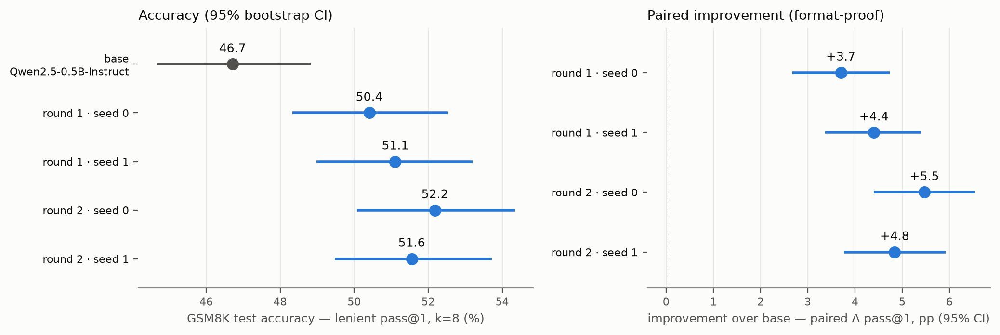

# grpo-math

A **from-scratch GRPO** (Group Relative Policy Optimization) pipeline — implemented
line-by-line, validated against TRL's `GRPOTrainer` — that makes
`Qwen/Qwen2.5-0.5B-Instruct` genuinely better at GSM8K math on **~$40 of single-H100
compute**, with every claim pre-registered, paired, format-proof, and seed-replicated.



**Result:** the base model truly solves **46.7%** of GSM8K test (lenient answer
extraction, k=8 sampling); two rounds of GRPO lift it to a replicated **52.2%**.
Every step's gain carries a paired bootstrap CI that excludes zero, measured so that
answer *formatting* cannot masquerade as math ability. The mechanism is honestly
characterized: pass@1 rises while pass@8 stays flat — GRPO sharpens the model into
reliably landing solutions it could previously only sometimes sample.

Full report: [`docs/g2_results.md`](docs/g2_results.md) · complete decision record
(pre-registrations, gates, amendments): [`docs/g2_plan.md`](docs/g2_plan.md)

## What's in here

1. **A from-scratch GRPO trainer** (pure torch core + vLLM rollouts with sleep/wake
   weight sync): group-normalized advantages, clipped PG + low-variance KL,
   truncated importance sampling, DAPO-style overlong masking, fp32 master weights,
   step-0 rollout/train alignment self-checks, entropy stop-loss. Validated
   curve-for-curve against TRL on an identical config.
2. **A measurement stack built for honesty**: dual strict/lenient grading
   (math-verify + a fallback extraction chain), paired bootstrap deltas, pass@k,
   difficulty maps, offline re-grading of old runs — all CPU-testable (355 tests,
   no GPU imports at module load).
3. **Findings you can only get by measuring carefully**:
   - The first phase's "+7.9pp" was mostly formatting; the format-proof re-measure
     is what the headline above reports instead.
   - vLLM's `kv_cache_dtype: fp8` silently corrupts Qwen2.5 generation (digit
     tokens dropped) — it deflated the 0.5B base by 14 points absolute and nearly
     fabricated a contamination narrative (`docs/g2_results.md`, erratum in
     `docs/ablation_and_sweep.md`).
   - **Iterated difficulty re-mapping**: after training plateaus, a $3 re-map of
     per-problem solve rates from the trained checkpoint buys another
     statistically-significant round of improvement (+1.8pp), replicated.
   - Small-model RLVR stability: every run eventually hits an entropy/length
     runaway; lr cuts extend the horizon (27 → 71 → 135 steps across lr levels)
     but never remove it. A stop-loss turns divergence into a bounded,
     checkpointed non-event (`docs/g1_diagnosis.md`).

## Repo layout

| Path | Contents |
|---|---|
| `configs/` | Inheritable YAML run configs (`base.yaml` → `g1_robust` → `g2_main_b` → `g2_round2_lr25`); eval configs (`eval_bf16.yaml`) |
| `src/grpo_math/trainer/` | GRPO trainer: `algo.py` (losses/advantages), `loop.py`, `policy.py`, `rollout.py`, checkpointing, metrics |
| `src/grpo_math/rewards/` | Strict `\boxed{}` + lenient fallback extraction, math-verify checking, reward |
| `src/grpo_math/eval/` | Benchmark registry, vLLM/fake backends, dual-grading eval runner |
| `src/grpo_math/data/` | GSM8K loading, difficulty-map filtering |
| `src/grpo_math/stats.py` | pass@1 / pass@k, bootstrap CIs, paired-delta CIs (NumPy only) |
| `scripts/` | `run_train.py`, `run_eval.py`, `build_difficulty_map.py`, `paired_delta.py`, `regrade_lenient.py`, `plot_curves.py`, `plot_g2_results.py`, `sample_audit.py`, `run_trl_reference.py` |
| `docs/` | `g2_results.md` (report) · `g2_plan.md` (decision record) · `g1_diagnosis.md` (stability investigation) · `ablation_and_sweep.md` (+erratum) · `PLAN.md` (original plan) |
| `report/` | Committed figures (results ladder, training overlays) |
| `tests/` | 355 CPU-only tests incl. golden-file checker cases |

## Quickstart (CPU dev)

```bash
python -m venv .venv
# Windows: .venv\Scripts\activate    macOS/Linux: source .venv/bin/activate
pip install -e ".[dev]"
pytest   # 355 tests, no GPU required
```

## Training & evaluation (single Linux H100)

```bash
pip install -e ".[gpu]"

# difficulty map -> train on the learnable band -> evaluate (bf16 KV!) -> paired delta
python scripts/build_difficulty_map.py --model Qwen/Qwen2.5-0.5B-Instruct \
    --k 8 --temperature 0.9 --top-p 1.0 --max-tokens 3072 --seed 0 \
    --out results/difficulty/qwen2.5-0.5b_k8
python scripts/run_train.py --config configs/g2_main_b.yaml
python scripts/run_eval.py --config configs/eval_bf16.yaml --benchmark gsm8k \
    --backend vllm --model <checkpoint>/model --k 8 --out-dir results/sweep2/candidate
python scripts/paired_delta.py --base results/sweep2/base --candidate results/sweep2/candidate \
    --benchmark gsm8k --metric lenient
```

Raw run outputs (`results/`) are gitignored; committed artifacts are the figures in
`report/` and the analysis in `docs/`.

## Honest limitations

- The gains are **reliability sharpening**, bounded by the base distribution's 78%
  pass@8 ceiling — group-relative RL gets zero gradient on problems the model never
  solves in-group, so it cannot teach genuinely new problems by itself.
- Transfer to MATH-500 / MMLU-STEM is flat (no collapse, no gain).
- The stable training horizon shrinks each round as the policy's entropy state
  compounds; a third re-mapping round would likely need lr ~1e-7 for a diminishing
  return.
- GSM8K appears in Qwen2.5's pretraining mix; dev (held-out train) numbers are
  inflated and used only for stability monitoring and checkpoint selection — all
  claims ride on the official test set.
