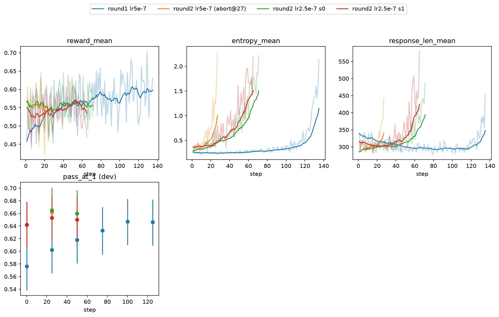

# G2 results: making a 0.5B model genuinely better at math with GRPO

**TL;DR.** Starting from `Qwen/Qwen2.5-0.5B-Instruct`, which truly solves
**46.7%** of GSM8K test (lenient extraction, k=8 sampling), two rounds of
from-scratch GRPO lift it to a replicated **52.2%** — a **+5.5pp** gain that is
format-proof, seed-replicated, statistically confirmed at every step, and
honestly characterized as *reliability sharpening* (pass@1 up, pass@8 flat).
Total compute across both rounds and all detours: **~$40 of single-H100 time**.


## Why this phase existed

The project's first training phase reported +7.9pp on GSM8K — but its own
analysis showed the gain was answer *formatting*, not math: the reward paid for
`\boxed{}` compliance, and the parse-rate jump explained everything. G2 was
designed so that a positive result could not be that artifact again:

- **Format-proof metric, pre-registered.** Lenient answer extraction
  (`\boxed{}` → `#### x` → "answer is x" → last number) so a correct answer
  counts however it is expressed; success bars, checkpoint-selection rules, and
  robustness checks fixed in `docs/g2_plan.md` *before* GPU spend.
- **Format-free reward.** Training pays only for correctness under the same
  lenient extraction (`format_bonus: 0`), with per-step extraction-method
  fractions logged as a reward-hacking tripwire.
- **Difficulty-band curriculum.** Training restricted to problems the current
  model solves 1–7 times out of 8 (`scripts/build_difficulty_map.py`) — the
  only region where GRPO's group-relative advantage is non-zero.
- **Paired evaluation.** Base and candidate answer the same 1,319 test
  problems; claims ride on paired bootstrap CIs (`scripts/paired_delta.py`),
  cross-checked strict-vs-lenient and on a decision-untouched test subset.

## Round 1: format-free GRPO on the base-model band

Recipe: G=8, 48 prompts/step, lr 5e-7 cosine, KL 0.006, truncation masking,
entropy stop-loss 2.0 (`configs/g2_main_b.yaml`). Both seeds converged on dev
by ~step 100 and were entropy-aborted at steps 135/139; candidate = best-dev
checkpoint (step 100, both).

| GSM8K test, k=8, paired vs base | lenient Δpass@1 | strict Δ | Δpass@8 |
|---|---|---|---|
| seed 0 (46.7% → 50.4%) | **+3.70 [+2.67, +4.73]** | +4.28 | +0.99 [−0.91, +2.88] |
| seed 1 (46.7% → 51.1%) | **+4.40 [+3.37, +5.40]** | +4.98 | +0.00 [−1.90, +1.90] |

The gain reproduces on the 819 test problems no interim decision ever touched
(+3.72 [+2.44, +5.02]) and shows no extraction-gaming signature (strict ≈
lenient). Transfer (MATH-500, MMLU-STEM): flat — no collapse, no free lunch.

## Round 2: iterated difficulty re-mapping

Hypothesis: the round-1 plateau is *gradient starvation* — the model masters
band problems, whose groups then carry zero advantage. Test: re-measure solve
rates with the trained checkpoint, rebuild the band, train again from that
checkpoint (`configs/g2_round2_lr25.yaml`).

The re-map itself confirmed partial starvation: mastered problems (8/8) grew
1,180 → 1,754, 202 previously-hopeless problems became reachable, yet the band
shrank only 7%. Training required one more lr halving (2.5e-7): the parent
checkpoint loads at elevated entropy, and the first attempt at lr 5e-7
entropy-aborted in 27 steps — with dev already rising.

| GSM8K test, k=8, paired | incremental vs round-1 parent | cumulative vs base |
|---|---|---|
| round 2, seed 0 (→ 52.2%) | **+1.77 [+0.88, +2.63]** | **+5.47 [+4.40, +6.54]** |
| round 2, seed 1 (→ 51.6%) | **+1.15 [+0.30, +2.00]** | +4.84 [+3.77, +5.92] |

Both runs clear the pre-registered incremental bar (CI > 0 and ≥ +1.0pp).
Iterated re-mapping is the phase's methodological contribution: a $3 re-map
buys another significant round of improvement after the naive recipe plateaus.



## What the model actually learned

Across all four trained models, pass@8 never moved while pass@1 rose ~4–5pp.
The mechanism is **sharpening**: the base model already *could* solve ~78% of
GSM8K within 8 attempts but landed only 47% on the first try; GRPO
redistributes probability from the model's own failure modes toward its own
successful reasoning paths. That is a real capability improvement in the
single-answer sense users experience — and explicitly not the acquisition of
new problem-solving ability, which group-relative RL cannot deliver on
problems where every sampled attempt fails (zero advantage ⇒ zero gradient).

## The fp8 KV-cache bug (read this before trusting any eval)

Every evaluation in this project before 2026-07-25 ran with vLLM
`kv_cache_dtype: fp8`, which silently corrupts Qwen2.5 generation — digit
tokens drop out of completions ("lay  eggs per day"), collapsing a 1.5B model
to ~2% and deflating the 0.5B base by **−14pp absolute** (0.316 with 80%
boxing under fp8 vs 0.459 with 97% boxing under bf16 — the latter matching
Qwen's published numbers). The earlier phase's "the base model can't format"
narrative and most of its train-contamination gap were artifacts of this bug.
All G2 numbers above use bf16 KV (`configs/eval_bf16.yaml`); an erratum marks
the affected doc (`docs/ablation_and_sweep.md`). Two portable lessons: pair
every comparison under identical inference settings, and anchor at least one
absolute number against an external reference.

## Stability: the recurring entropy runaway

Every run in this repo eventually hits an entropy/length runaway; stabilizers
(lr cuts, truncation masking, cosine decay, KL) each extend the horizon
without eliminating it, and the horizon shrinks as training compounds
(round 1: ~135 steps at lr 5e-7; round 2: ~70 at 2.5e-7, 27 at 5e-7). The
entropy stop-loss (abort > 2.0) turned each divergence into a bounded,
checkpointed non-event — every result above comes from a run that ended in a
controlled abort *after* its dev curve had plateaued. Dev-based checkpoint
selection plus test-set-only claims kept this from contaminating the numbers.

## Costs

| item | ≈ cost |
|---|---|
| Round 1 (difficulty map, 2×~135-step runs incl. one aborted recipe, evals, re-grades) | $26 |
| Round 2 (re-map, 3 runs incl. one 27-step abort, 3 k=8 evals) | $14 |
| **Total (H100 @ ~$2.2/hr, all detours included)** | **~$40** |

## Reproducing

The full decision record — pre-registrations, amendments, every gate's numbers
— is `docs/g2_plan.md`. The pipeline, end to end:

```bash
# 1. difficulty map from the current policy (H100)
python scripts/build_difficulty_map.py --model <model-or-checkpoint> \
    --k 8 --temperature 0.9 --top-p 1.0 --max-tokens 3072 --seed 0 --out results/difficulty/<name>

# 2. train on the band (see configs/g2_main_b.yaml / g2_round2_lr25.yaml)
python scripts/run_train.py --config configs/g2_main_b.yaml

# 3. evaluate base + candidate under identical settings (bf16 KV!)
python scripts/run_eval.py --config configs/eval_bf16.yaml --benchmark gsm8k \
    --backend vllm --model <checkpoint>/model --k 8 --out-dir results/sweep2/<name>

# 4. paired, format-proof comparison
python scripts/paired_delta.py --base results/sweep2/<base> \
    --candidate results/sweep2/<candidate> --benchmark gsm8k --metric lenient

# headline figure
python scripts/plot_g2_results.py --out report/g2_results.png
```
